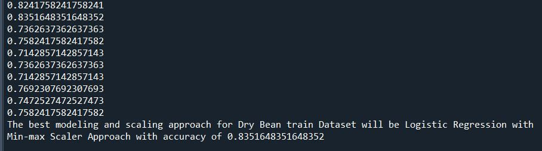

# Heart-disease-prediction
According to the World Health Organization (WHO), around 17.9 million people die each year as 
a result of cardiovascular illnesses (CVDs), making CVD the leading cause of mortality worldwide. 
CVDs are a collection of heart and blood vessel illnesses that, if left untreated, can lead to a 
heart attack. The existence of an obstruction in the heart's blood flow causes a heart attack. 
The presence of a blockage could be caused to fat, cholesterol, or other substances accumulating. 
Despite the fact that treatment has improved over time and the pathogenesis of most CVDs has 
been explained, a heart attack can still be lethal.As a result, doctors think that preventing 
a heart attack is always preferable to treating one.

As a result, doctors think that preventing a heart attack is always preferable to treating one. 
After years of research, scientists and clinicians discovered that the patient's age, gender, 
exercise-induced angina, number of major vessels, chest pain indication, resting blood pressure, 
cholesterol level, fasting blood sugar, resting electrocardiographic results, and maximum heart 
rate achieved can all be used to predict the likelihood of a heart attack. 

As a result, this app were created to forecast the likelihood of a person suffering a heart attack.

Down below is the features of the data :

1) Age : Age of the patient
2) Sex : Sex of the patient
3) cp : Chest Pain type [Value 0: typical angina, Value 1: atypical angina,Value 2: non-anginal pain,Value 3: asymptomatic]
4) trtbps : resting blood pressure (in mm Hg)
5) chol: cholesterol in mg/dl fetched via BMI sensor
6) fbs: (fasting blood sugar > 120 mg/dl) [1 = true,0 = false]
7) rest_ecg: resting electrocardiographic results [Value 0: normal, Value1: having ST-T wave abnormality (T wave inversions and/or ST elevation or depression of > 0.05 mV), Value 2: showing probable or definite left ventricular hypertrophy by Estes' criteria]
8) thalach: maximum heart rate achieved
9) exang: exercise induced angina [1 = yes,0 = no]
10) old peak: ST depression induced by exercise relative to rest
11) slp: the slope of the peak exercise ST segment [0 = unsloping, 1 = flat, 2 = downsloping]
12) caa: number of major vessels (0-3)
13) thall : thalassemia [0 = null,1 = fixed defect,2 = normal,3 = reversable defect]
14) output: diagnosis of heart disease (angiographic disease status)
     0: < 50% diameter narrowing. less chance of heart disease
     1: > 50% diameter narrowing. more chance of heart disease

# Results
This studies involve Logistic Regression, Random Forest, Decission Tree, KNeighbors and SVC models.
The data set were split into train and test data before the train data were use to train all the model.
Then the score of the model were compared such below:
 
